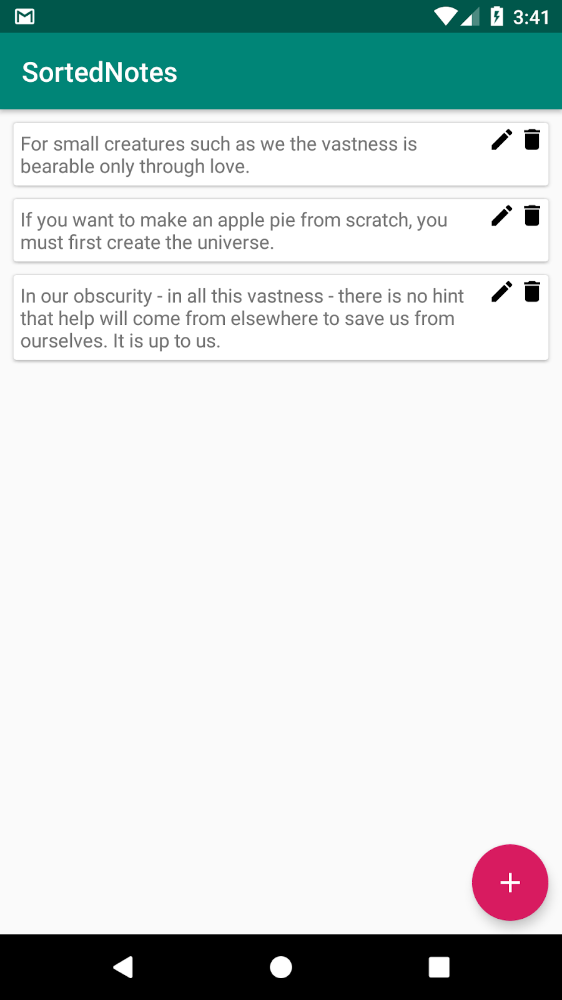
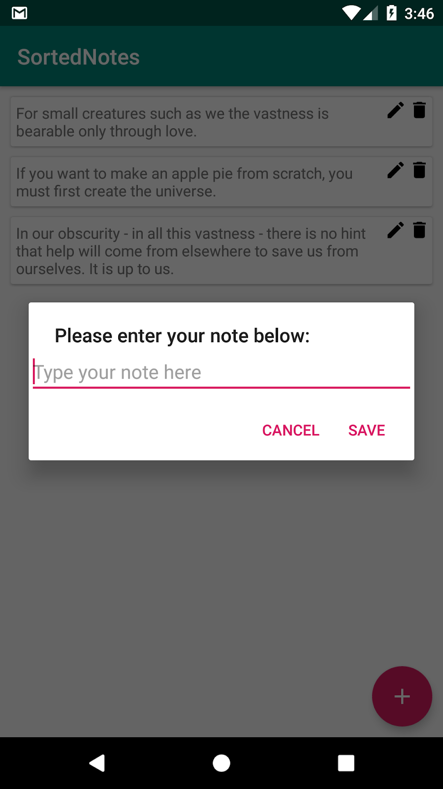

# Junior Android Dev Interview Coding Challenge

It’s coding challenge time :) ! A developer has started a new app called “SortedNotes” but he does not have time to finish it and needs your help! There’s one problem though, this developer will be trying to sell this app to Apple Inc. tomorrow when he leaves on a business trip so you have until 17:00 today to complete it!

## General rules

- Hand-in time: 17:00
- The bonus question (Step 6 below) is not compulsory but please try to do it, even if you can’t finish it! Make sure to finish everything else before you start with it.
- Feel free to search the web for help! Stackoverflow is your friend :). You will be asked questions on your code so make sure you understand your code, don’t copy and paste blindly!
- Don’t reinvent the wheel! Use as many Java/Android APIs as you like. You are not allowed to import any new libraries though.
- Feel free to contact Wess if you run into any problems that you can’t seem to fix. He will try his best to help you without doing the challenge for you.
- Before you read any further, relax! You have more than enough time to complete the challenge.

## Step 1: Import Project

Go to https://github.com/HeinrichWesson/SortedNotes and click on the “Clone or download” button to download the project. 

If you already have a project open in Android Studio:
Open Android Studio -> go to File -> Open -> navigate to the downloaded project and open it

If you don’t have a project open: 
Click on “Open an existing Android Studio project” and follow the prompts from there.

You’re ready to start coding!

## Step 2: Before you start coding

- Press “ctrl + shift + f” to do a project wide search for “TODO”. You’ll find all the parts of existing code that you need to complete/fill in. However, keep in mind that these are just to guide you to a certain extent and do not contain everything you need to complete the challenge. You’ll still need to add more methods/variables etc.!
- All the layout files have already been coded, no need to do XML!

**Coding rules**
- You are not allowed to use the method RecyclerView.Adapter.notifyDataSetChanged(). It is already being used in MainActivity.initRecyclerViewWithAdapter(), that’s fine, don’t use it anywhere else please! 
Rather use Adapter methods such as notifyItemRemoved() for example. There are more!
- Make sure to read the TODO comments, there are sometimes tips/guidelines in them.

## Step 3: Show the default list

Start off by implementing the code necessary to show the list of notes that’s generated by the method MainActivity.generateDefaultNotes(). The list should be sorted at runtime via the length of the text (number of characters) in the note. It should look like below once done: 

## Step 4: Add a new note dialog

When the user clicks the pink “+” floating action button (see image above), they should be shown a dialog where they can type their note. 

Implement the code necessary to show this dialog (use AlertDialog.Builder). Use R.layout.dialog_add_note.xml for the dialog layout. 
If the user clicks cancel on the dialog, the dialog should dismiss without adding a new note.
If the user clicks save, the dialog should dismiss and the new note shown in the list. Be sure to insert the note at the correct position so that the list is still sorted in ascending order via text length (refer to the method NotesAdapter.sortNotes())! Remember, you’re not allowed to use notifyDataSetChanged()!

Once done, it should look something like below:

## Step 5: Deleting a note

When the user clicks on the bin icon on any note, this note should be removed from the list. It is not necessary to ask the user “Are you sure?” before removing the note.

## BONUS! Step 6: Editing a note

When the user clicks the pencil icon on any note, they should be shown a dialog that pre-fills the EditText with the note’s current text. The user can then make edits and save the note again. Remember that the notes need to be sorted via text length and you are not allowed to make use of notifyDataSetChanged()!

## Step 7: Review and Testing

As all good developers do, review your code and make sure it’s in the best possible state that you can imagine. Test your code thoroughly by playing around with the app!

## Step 8: Hand in your project

You’re done! Well done on reaching this step! 

Share the project with Wess.
